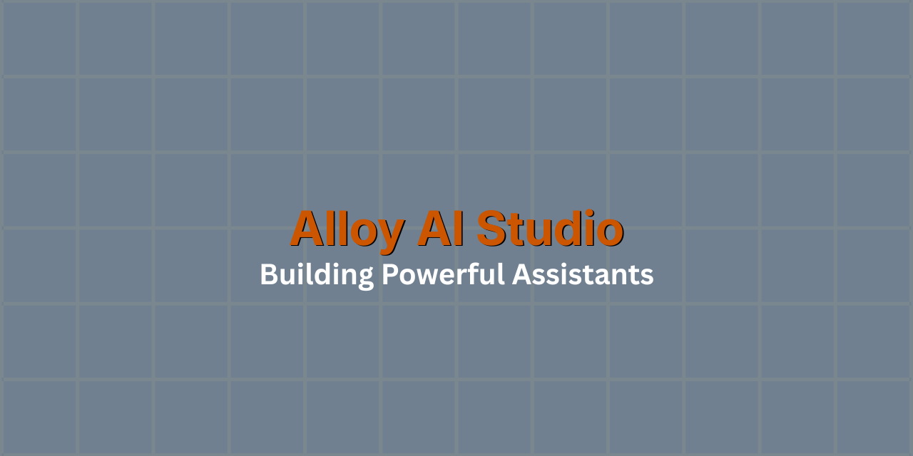

# 🛰️ Adam Spach-Ford | CAIC
**Mediating the friction between technical AI capabilities and business ROI.**

*Systemic Risk Specialist & AI Implementation Lead at Alloy AI Studio.* Delivering production-grade, Powerful Assistants for the Denver enterprise market.

---

### 📊 Executive Dashboard

| 🎯 Techno-Functional Leadership | 🛡️ Trust & Governance |
| :--- | :--- |
| **Mission:** Translating complex AI architecture into measurable business outcomes.  **Focus:** Large Language Models (LLMs), LangChain, AutoGen, and low-code deployment tools (Replit, Vercel).  **Advantage:** Navigating organizational friction to align developers, executives, and stakeholders. | **Posture:** Auditable frameworks for systemic risk mitigation and secure deployments.  ✔️ **AI Strategy:** Certified Artificial Intelligence Consultant (CAIC) ✔️ **Security:** CompTIA Security+ \| Qualys VMDR ✔️ **Systemic Risk:** FEMA Incident Command System (ICS 100/200) |

---

### 📐 UI/UX Philosophy: The Quad-Hybrid Standard
A production-grade AI model is only as effective as the interface that delivers it. Every tool deployed by Alloy AI Studio adheres to a strict design framework designed to make complex enterprise data feel natural and accessible. 

My front-end architecture focuses on four key pillars:
* **Bento Grids:** Clean, modular information architecture for highly dense data displays.
* **Fluid State Morphing:** Seamless, Framer Motion-style transitions between user states to maintain context.
* **Micro-Interaction Reveals:** Purposeful, subtle feedback mechanisms that guide user behavior without visual clutter.
* **Cinematic Scrollytelling:** Narrative-driven data presentation to enhance user retention and comprehension.

---

### 🛡️ Core Stack & Governance
Deploying enterprise-ready Powerful Assistants requires a rigorous approach to both functional implementation and systemic security. My technical foundation ensures that AI capabilities are balanced with strict risk mitigation and data hygiene protocols.

**Certifications & Frameworks:**
* **AI Strategy & Implementation:** Certified Artificial Intelligence Consultant (CAIC)
* **Threat & Posture Management:** CompTIA Security+, Qualys Vulnerability Management Detection and Response (VMDR)
* **Risk & Incident Governance:** FEMA Incident Command System (ICS 100 & 200)

**Operational Focus:**
Translating complex architectures into auditable frameworks, ensuring digital hygiene, and managing organizational change to guarantee measurable business outcomes.

---

### 🔍 Strategic Market Intelligence & AI-Driven Research
Delivering measurable ROI starts long before development. It requires pinpointing exactly where enterprise workflows are bottlenecked or specific market needs remain underserved. I leverage advanced AI workflows to conduct deep market gap analysis, ensuring every product deployed solves a validated, high-demand problem.

**The Discovery Framework:**
* **Agentic Deep Research:** Deploying specialized, multi-prompt LLM architectures—acting as a virtual research C-suite—to analyze vast market datasets, synthesize competitor feature gaps, and map user sentiment at a scale and speed traditional research cannot match.
* **Underserved Niche Identification:** Translating qualitative AI insights into actionable market gaps. I target high-leverage opportunities where targeted, secure AI implementation can yield disproportionate returns.
* **Risk-Adjusted Feasibility:** Cross-referencing identified market gaps against technical constraints and systemic risk factors to ensure any proposed solution is viable, auditable, and ready for enterprise integration.
* **Rapid Prototyping Alignment:** Moving seamlessly from validated market research directly into architecting the exact system requirements and UI/UX flows needed to capture the opportunity.

---

### 📍 Let's Connect
I am currently seeking **AI Consultant and Implementation Specialist** opportunities within the **Denver, CO** metropolitan area. 

If your organization is looking for a techno-functional leader to bridge the gap between technical AI capabilities and measurable business ROI, I'd love to connect.

* 💼 [Connect on LinkedIn](https://www.linkedin.com/in/adam-spach-ford)
* 📄 [View My Resume](https://link-to-your-resume.com](https://drive.google.com/file/d/1oxQRwANRwr7cLiYpNakqw02BcQgz9HKZ/view?usp=sharing))
* 📧 [Reach out via Email](mailto:adamsprompt@gmail.com)

---

   
  

